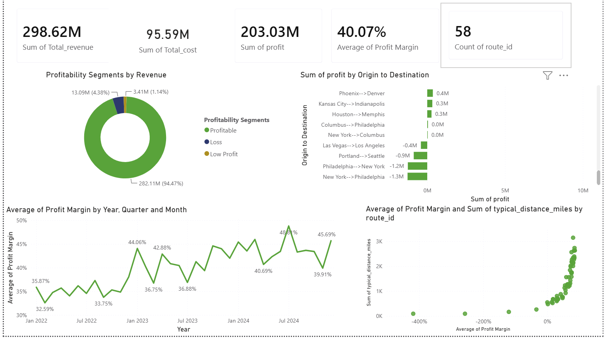
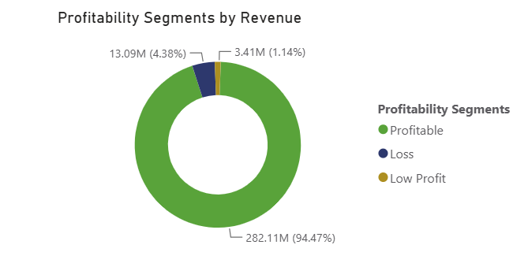
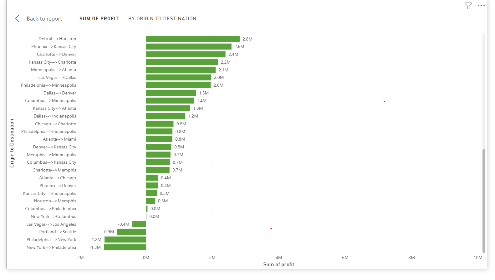
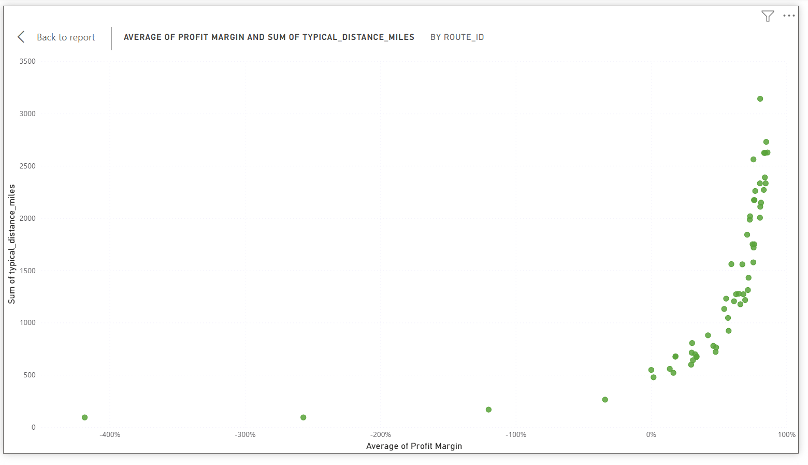
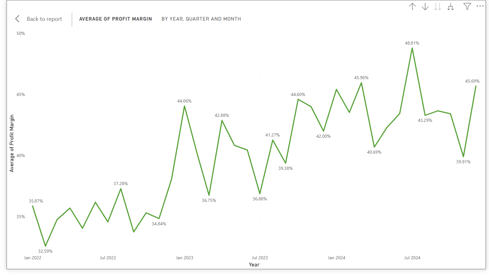

# Meridian Freight — Route Profitability Analysis

**A route-level profitability investigation that found roughly $3.8M in annual profit being erased by four lanes, inside a network that looked 94.47% healthy by revenue.**

Meridian Freight is a regional trucking network running 58 lanes (origin→destination pairs), each mapped one-to-one to a route_id. Total network profit sits at $203.03M on $298.62M in revenue — a 40.07% average margin that looks healthy, and has actually been trending upward since 2022.

That healthy topline was the problem. The VP of Supply Chain, who decides which lanes to keep, cut, reprice, or shift capacity toward, had no way to see past the network average to know whether every lane underneath it was actually pulling its weight. A margin that looks fine in aggregate doesn't mean nothing is losing money — it just means nothing losing money is big enough to show up yet. This analysis exists to give that lane-level view back.

**Key finding:** every loss-making lane runs 262 miles or under — short-haul lanes structurally can't recover fixed per-load costs (loading, deadhead, idle time) over so few revenue miles, regardless of how competitive the per-mile rate is. Across the full 58-lane network, margin climbs steadily with distance, reaching as high as 86.03% on the longest lanes (Charlotte→Portland, 2,627 mi). The clearest proof of the root cause is a natural experiment sitting right in the data: Philadelphia→New York and New York→Philadelphia are the same 92-mile round trip, priced almost twice as far apart as any other pair in the network ($2.79/mi vs. $1.61/mi) — and both post catastrophic losses (-256.82% and -418.35% margin). Rate isn't the variable that matters here; distance is.

**Recommendation:** a short-haul rate floor for lanes under ~600 miles, reprice/renegotiate the four losing lanes, keep an eye on two more that only just crossed back to breakeven, shift capacity toward the network's strongest long-haul performers, and extend the network-level trend view down to the lane level so a failing lane gets flagged in the month it turns negative, not after it's been losing money for years.

*The assembled Power BI dashboard this analysis is built from — KPI summary, profitability segmentation, profit by lane, margin trend, and the margin-vs-distance relationship.*

## Background and Overview

Meridian Freight is a regional trucking network running 58 lanes (origin→destination pairs, one route_id per lane). Total network profit sits at $203.03M on $298.62M in revenue — a 40.07% average margin that looks healthy, and has actually been trending upward since 2022.

The trigger for this analysis: a network-wide margin that looked fine in aggregate gave the Supply Chain team no way to see that specific lanes were losing money badly enough to be a real problem, not just noise.

## North Star Metric & Dimensions

**North Star Metric: Profit Margin % per Lane** (equivalently, Profit per Mile), not Total Profit or the network average margin.

Both of the obvious network-level numbers hide this problem. Total Profit ($203.03M) is dominated by 94.47% of revenue sitting in a healthy "Profitable" segment — four failing lanes, out of 58, don't move that needle. And the network's average margin (40.07%) has been trending *up* for three years, which could easily read as "everything is fine" even while individual lanes deteriorate underneath it. A per-lane margin metric can't be padded by scale or by the performance of unrelated lanes — it shows a bad lane as bad no matter how the rest of the network is doing.

**Component metrics** (the two inputs that roll up into the North Star, and the reason it moves):
- **Revenue per Mile** (base_rate_per_mile) — the pricing side
- **Cost per Mile** (total_cost / distance) — the cost side

This dataset doesn't carry a direct Cost per Mile figure, but the same diagnosis is still possible: if rate (Revenue per Mile) were the real driver, two lanes on the same route priced far apart should perform very differently. They don't (see Evidence) — which points at cost, not price, as the actual problem.

**Dimensions** (how the North Star gets sliced to find where the problem lives):
- Lane (origin → destination)
- Distance band (short-haul under ~600 mi vs. long-haul, which now spans up to ~3,100 mi in the full dataset)
- Time (month / quarter — the network trend exists; the missing piece is this same view at the lane level)

## Recommendations

1. **Reprice or renegotiate the four loss-making lanes now**, which together account for **roughly $3.8M** in lost profit, all at **92–262 miles** of typical distance:
   - Las Vegas → Los Angeles: **-33.97%** margin, **-$0.4M** (262 mi, $2.63/mi)
   - Portland → Seattle: **-119.99%** margin, **-$0.9M** (167 mi, $2.42/mi)
   - Philadelphia → New York: **-256.82%** margin, **-$1.2M** (92 mi, $2.79/mi)
   - New York → Philadelphia: **-418.35%** margin, **-$1.3M** (92 mi, $1.61/mi)

   *(The two most extreme figures, -256.82% and -418.35%, are consistent with the short-haul thesis but extreme enough to be worth a data spot-check — confirming the cost allocation on these two specific lanes before using them as headline numbers externally.)*

2. **Watch two more lanes that just crossed back to breakeven.** Columbus → Philadelphia (476 mi, $2.06/mi) improved from -10.59% to **+1.84%**, and New York → Columbus (547 mi, $1.69/mi) improved from -10.61% to **+0.13%** — both essentially flat, not fixed. Both moves track with the revenue correction described below, not a real change in the lanes' underlying economics, so they're not out of the woods yet.

3. **Introduce a short-haul rate floor or fixed-cost surcharge for lanes under ~600 miles.** The Philadelphia↔New York pair is the cleanest evidence in the dataset: same 92-mile round trip, priced at $2.79/mi in one direction and $1.61/mi in the other — nearly a 2x difference — and both directions still post massive losses. If rate were the problem, the higher-priced direction would look meaningfully better. It doesn't. That rules out pricing execution and confirms this is a fixed-cost-absorption problem: short lanes can't spread loading, deadhead, and idle time over enough revenue miles no matter what the rate is.

4. **Shift capacity toward the network's strongest long-haul performers.** Across the full 58-lane network, the top three by margin are Charlotte → Portland (86.03%, 2,627 mi), Philadelphia → Seattle (85.06%, 2,729 mi), and Columbus → Portland (84.65%, 2,332 mi) — all well over 2,000 miles. The pattern holds network-wide: every lane above ~2,000 miles sits at 76%+ margin, while every lane under ~300 miles is at breakeven or worse.

5. **Validate the maintenance/cost allocation on the two most extreme lanes** (Philadelphia↔New York) before finalizing the rate floor in recommendation 3 — see the caveat under recommendation 1.

6. **Reconcile the Profitability Segments figures before publishing them externally.** The Loss ($13.09M) and Low Profit ($3.41M) dollar totals are identical before and after the revenue correction that moved two lanes from losing to breakeven — which shouldn't be possible if those two lanes were counted in Loss before. Likely explanation: the segmentation visual is on a different or stale measure than the lane table. Worth confirming in Power BI before quoting these percentages in front of a stakeholder.

7. **Extend the trend view down to the lane level.** The network-level margin trend (see Evidence) already proves this kind of tracking is possible and already built — the network average climbed with real volatility, from a 32.59% dip in 2022 to a 48.81% peak by mid-2024, settling around 45.69% since. The gap is that this view stops at the network level. The same chart, run per lane with a threshold flag, would have caught a lane crossing into negative margin the month it happened instead of leaving it to accumulate for years inside a rising network average.

## Evidence

**Segmentation (network-wide, by revenue):** Profitable — 94.47% ($282.11M) · Loss — 4.38% ($13.09M) · Low Profit — 1.14% ($3.41M).

*Note: the Loss and Low Profit dollar figures are unchanged from the prior version of this analysis despite two lanes moving from negative to positive margin in the same period — see Recommendation 6. Treat these two percentages as provisional pending confirmation.*

**Profit by lane** — the four losing lanes sit clearly apart at the bottom, and none of them are large enough in dollar terms to move the network average on their own, which is exactly why they went unnoticed without a lane-level breakdown. Two more lanes, Columbus→Philadelphia and New York→Columbus, sit right at $0.0M — not losses anymore, but not meaningfully profitable either:

**The distance relationship** is the core evidence for the root cause, and it holds across the entire 58-lane network, not just a subset. Plotting Average Profit Margin against typical distance shows a clean structural curve: every lane under ~300 miles clusters at breakeven or worse, margin climbs steadily through the 500–1,500 mile range, and levels off around 75–86% on the longest lanes (2,000–3,141 miles, topping out with Miami→Seattle at 3,141 mi).

**Rate-vs-outcome check:** Las Vegas → Los Angeles charges $2.63/mi — higher than most lanes in the network — and still posts a -33.97% margin. Philadelphia → New York charges the single highest rate in the network, $2.79/mi, and still loses -256.82%. Meanwhile the reverse direction of that same 92-mile trip, New York → Philadelphia, charges one of the *lowest* rates, $1.61/mi, and loses even more, -418.35%. Two lanes, same distance, nearly double the rate spread, both catastrophic. This is the strongest evidence in the dataset that the problem is structural (distance/fixed cost), not a pricing execution error.

**Margin over time:** the network average has trended upward for three years, with real volatility along the way — a low of 32.59% in 2022, climbing to a 48.81% peak by mid-2024, and settling around 45.69% since. That's genuinely good news at the network level, but it's also exactly the kind of number that can mask a handful of consistently failing lanes sitting underneath it. A rising average is not proof that every component of that average is healthy.

**Lane data — the outliers that drive this analysis.** The full network is 58 lanes; showing all of them here would bury the point the same way the network average does. Below are the lanes that actually matter to this story — the four losses, the two breakeven lanes, and the ten strongest long-haul performers. The complete 58-lane dataset lives in the Power BI file.

| Origin → Destination | Revenue per Mile ($/mi) | Distance (mi) | Avg. Profit Margin |
|---|---|---|---|
| Charlotte → Portland | 2.69 | 2,627 | 86.03% |
| Philadelphia → Seattle | 2.50 | 2,729 | 85.06% |
| Columbus → Portland | 2.69 | 2,332 | 84.65% |
| Seattle → Charlotte | 2.47 | 2,623 | 84.26% |
| Phoenix → Philadelphia | 2.71 | 2,389 | 84.04% |
| Charlotte → Seattle | 2.39 | 2,623 | 83.53% |
| Columbus → Los Angeles | 2.74 | 2,269 | 83.29% |
| Seattle → Indianapolis | 2.48 | 2,147 | 81.25% |
| Houston → Portland | 2.45 | 2,108 | 80.66% |
| Miami → Seattle | 1.65 | 3,141 | 80.59% |
| ... | | | *(48 more lanes, all positive, not shown)* |
| Columbus → Philadelphia | 2.06 | 476 | 1.84% |
| New York → Columbus | 1.69 | 547 | 0.13% |
| Las Vegas → Los Angeles | 2.63 | 262 | **-33.97%** |
| Portland → Seattle | 2.42 | 167 | **-119.99%** |
| Philadelphia → New York | 2.79 | 92 | **-256.82%** |
| New York → Philadelphia | 1.61 | 92 | **-418.35%** |
| **Total / Network Average (58 lanes)** | **—** | **80,707** | **40.06%** |
